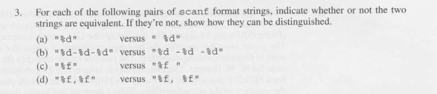

a) equivalent because scanf ignores white spaces
b) not equivalent because the first will not skip the white spaces and if the input have white spaces it will fail
c) not equivalent because when you have a white space after the format string scanf keeps reading until it reaches a non white space character, which will keep reading forever
d) equivalent because the white space will be ignored