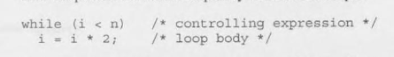
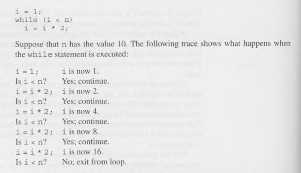
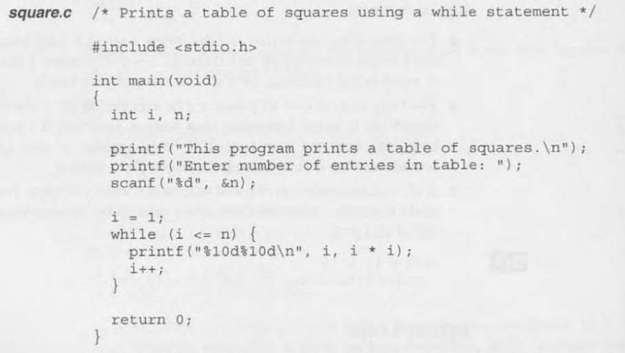
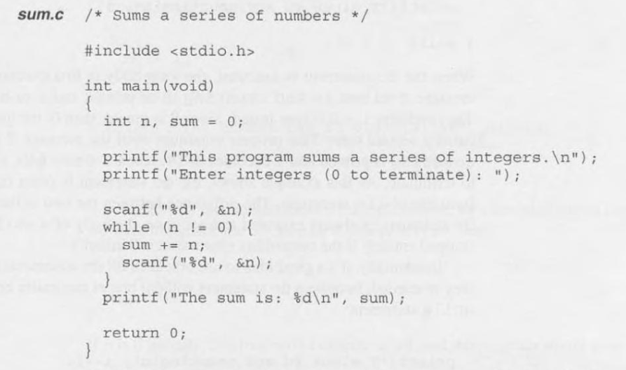
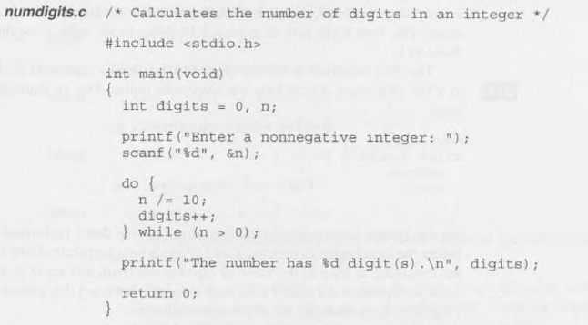
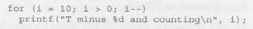
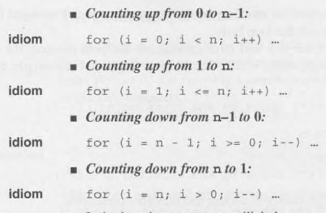
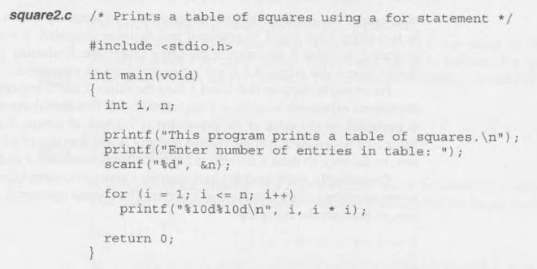
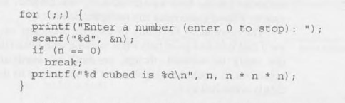

# 6 - Loops

- A **loop** is a statement whose job is to repeatedly execute some other statement
- Every loop has a **controlling expression**
- C provides three iteration statements, 
    - `while` - the controlling expression is tested *before* the loop body is executed
    - `do` - the expression is tested *after* the loop body is executed
    - `for` - convenient for loop that increment/decrement variables
- There are C features used in conjunction with loops
    - `break` - jumps out of the loop
    - `continue` - skips the loop iteration
    - `goto` - jumps to any statement within a function

## 6.1 - The `while` statement

- The `while` statement has the form: 
    - `while ( expression ) statement;`

- 

- When the `while` statement is executed, the controlling expression is evaluated first
- If its value is nonzero (true) the expression is tested again
- And loops until its zero (false)

- The loop keeps going as long as the controlling expression is true
- To add more than one statement, curly braces `{}` are mandatory

- The controlling expression is false when a `while` loop terminates
- Otherwise, the loop will be executed forever
- A loop may never be executed if the expression is false before the statement

### Infinite Loops

- `while (1) `
- A `while` statement like this will execute forever unless its body constain a statement that transfer control out of the loop
- that being `break`, `goto` or `return`
- Examples:   

## 6.2 - The `do` statement

- The `do` statement is related to the `while` statement and has the form: 
    - `do statement while ( expression );`
- The loop body is executed first, then the controlling expression is evaluated
- If its value is nonzero (true) the expression is tested again
- And loops until its zero (false)
- The only difference from the `while` loop is that the `do` body will execute at least 1 time
- Example: 

## 6.3 - The `for` statement

- The best way to write many loops
- Ideal for loops that have a counting variable
- The `for` statement has the form:
    - `for ( expr1 ; expr2; expr3 ) statement`

- 
    - First, `i` is initialized to 10
    - Then `i` is tested to see if its greater than 0
    - Since it is, it will evaluate the printf
    - And at last, it will decrement with `i--` and loop again

### `for` Statement Idioms

- The `for` loop is the best choice for loops that count up or down
- The best forms to do that are:

- Mistakes often made that should be avoided: 
    - Using `<` or `>` wrong. Counting up loops should use the `< <=` operator, while counting down loops use `> >=`
    - Using `==` in the expression
    - Writing `i <= n` instead of `i < n`

### Omitting Expressions in a `for` statement

- You can ommit any of the 3 expressions in the `for` statement
- The semicolon must still remain
    - If the *first* expression is ommited, no expression is initialized before
    - If the *second* expression is missing, it defaults to a true value
    - If the *third* expression is ommited, the loop body is then responsible to ensure that the second expression will be false

### `for` Statements in C99

- In C99, you can declare variables inside the `for` statement
- A variable declared by a `for` loop can't be acessed outside the body of the loop
- The variable dont need to be declared prior to this statement
    - If so, `for` creates a new version of that variable 

### The Comma Operator

- You can declare multiple variables of the same type separated by a comma
- The comma can be used in the first and third expression to initialization and/or incrementation of multiple variables
- It's evaluated from left to right 

## 6.4 - Exiting from a Loop

- Occasionally we need to exit loops in the middle point, with that we use `break` statements
- `continue` makes it possible to skip part of the loop iteration without breaking out of the loop
- `goto` allows a program to jump from one statement to another

### The `break` Statement

- Useful for writing loop in which the exit point is in the middle of the body
    - Like loops that read user input, terminating when a value is entered
- A `break` statement transfer control out of the innermost loop, so the outer will not be escaped if nested
- Example: 

### The `continue` Statement

- Doesn't exit a loop 
- The control remains inside the loop just before the end of the loop body
- Continues the loop over again from the beginning

### The `goto` Statement

- Is capable of jumping to any statement in a function, provided that the statement has a label
- In C99, there is an restriction that it cant be used to bypass the declaration of a variable-lenght array
- A label is an identifier placed at the begging of a statement:
    - `identifier : statement`
- `goto` has the form: 
    - `goto identifier ;`
- Rarely used

## 6.5 - The Null Statement

- A statement can be `null`, devoid of symbols except for the semicolon at the end
- Example: `i = 0; ; j = 1;`, the middle statement is `null`
- `if` statements with a semicolon at the end are `null` statements
