# 7 - Basic Types

- Full range of integer types:
    - `long integers`
    - `short integers`
    - `unsigned integers`

- Full range of float types:
    - `double`
    - `long double`

- `char` type
- `typedef` define new type names
- `sizeof` operator

## 7.1 - Integer Types

- Integer types are divided into two categories:
    - signed and unsigned

### Signed and Unsigned Integers 

- The leftmost bit of a **signed** integer is the sign bit, 0 if its positive or 1 if its negative
- The leftmost bit of a **unsigned** integer is part of the number's magnitude
- The largest 16-bit integer is:
    - `0111111111111111` which is *32,767*
- The largest 32-bit integer is:
    - `01111111111111111111111111111111` which is *2,147,483,647*
---

- `int` type is usually 32 bits 
- We can specify that a variably is `long`, `short`, `signed` or `unsigned`: 
 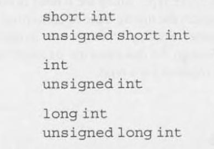

- Using `signed` is redundant
- Omitting `int` to abbreviate the names of integer types is allowed

- Integer Types on a 16-bit Machine: 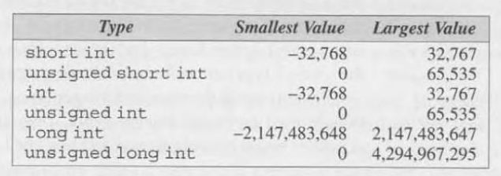
- Integer Types on a 32-bit Machine: 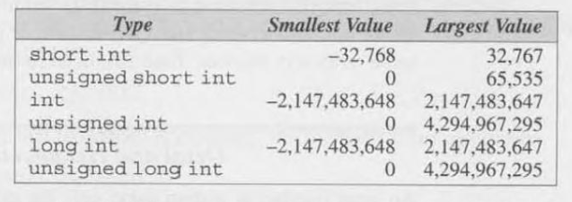
- Integer Types on a 64-bit Machine: 

- This may vary between compilers
- `<limits.h>` header works to check this

### Integer Types in C99

- C99 provides two additional standard integer types:
    - `long long int`
        - has a range of **-2^63** (`-9,223,372,036,854,775,808`) to **-2^63**
    - `unsigned long long int`
        - has a range of **0** to **2^64 - 1** (`18.446.744,073,709,551,615`)

### Integer Constants

- C allows integer constants to be written in decimal (base 10), octal (base 8), or hexadecimal (base 16).

- Decimal constants: Contain only digits 0 through 9 
    - Must not begin with a `0`
    - Ex. `32767`

- Octal constants: Written using only 0 through 7, where each position in an octal number represents a power of 8.
    - Must begin with a `0`
    - Ex. `077777`

- Hexadecimal constants: Contain only digits 0 though 9 and letter between a and f
    - Must begin with `0x`
    - May be either upper or lower case
    - Ex. `0x7fff`

- Postfixing `L` or `l` make the compiler read the constant as a `long int`
- Postfixing `U` or `u` make the compiler read the constant as a `unsigned`

### Integer Constants in C99

- in C99, postfixing `LL` or `ll` have type `long long int`

### Integer Overflow

- When you make an operation like `int + int` and the result is bigger than an `int` type, thats called **overflow**
- The result is undefined behaviour

### Reading and Writing Integers

- If used `u`, `o`, or `x` in the conversion specification:
    - `u` means decimal notation
    - `o` means octal notation
    - `x` means hexadecimal notation


## 7.2 - Floating Types

- Full range of floating types:
    - `float` Single-precision floating-point
    - `double`  Double-precision floating-point
    - `long double`  Extended-precision floating-point

- Characteristics of floating types according to the IEEE standard: 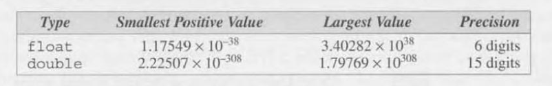

- `<float.h>` provides macros that define characteristics of floating types
- C99 has two categories:
    - **real floating types**
         - `float`
         - `double`
         - `long double`
    - **complex types**
        - `float_Complex`
        - `double_Complex`
        - `long double_Complex`

### Floating Constants

- A floating constant must contain a decimal point and/or an exponent
- To force the compiler to store a constant in a floating point you postfix the letter `F` or `f` 
- To do that in a long double format you postfix `L` or `l`

### Reading and Writing Floating-Point Numbers

- `%e`, `%f` and `%g` are used for single-precision floating numbers
- double and long double require:
    - `%lf` when reading and writing a double
        - in `printf`, you may use the single-precision ones
    - `%lf`, `%le` or `%lg` when reading and writing a long double
         
## 7.3 Character Types

- `char` is the character type, its value can vary from computers

### Character Sets

- **ASCII** is the standard character set for most computers
- a 7-bit code is capable of representing 128 characters
- in ASCII, the digits 0 to 9 are repesented by the codes **0110000-0111001**
- A to Z by **1000001-1011010**
- ASCII can be extended to **Latin-1** 

---

- A variable of type `char` can be assigned any single character:
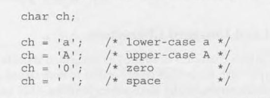

- character constants must be in single quotes

### Operation on Characters

- Characters in C are treated as integers in binary
- They can perform arithmetic and comparisons 
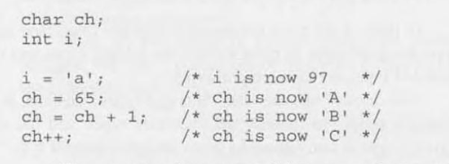

- We can write `for` loops to control upper-case letters:

```C
for (ch = 'A'; ch <= 'Z'; ch++) ...
```

### Signed and Unsigned Characters

- Signed characters have values between **-128** and **127**
- Unsigned are between **0** and **255**
- C89 uses **integral types** to refer both integer and character types
- C99 includes enumerated types too

### Arithmetic Types

- The integer types and floating types are know as arithmetic types
- Summary of the arithmetic types in C89, divided into categories and sub categories:
    - Integral types
        - `char`
        - Signed integer types (`signed char, short int, int, long int`)
        - Unsigned integer types (`unsigned char, unsigned short int, unsigned int, unsigned long int`)
        - Enumerated types
    - Floating types (`float, double, long double`)
- C99 has a more complicated hierarchy for its arithmetic types:
    - Integer types
        - `char`
        - Signed integer types standard and extended
        - Unsigned integer types standard and extended
        - Enumerated types
    - Floating types
        - Real floating types
        - Complex types (`_Complex`)

### Escape Sequences

- There are two kinds of escape sequences: *character escapes* and *numeric escapes*:
- Character escapes: 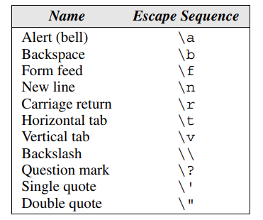

- Numeric escapes can represent any character in the ASCII table 
    - An *octal escape sequence* consists fo the \ chaacter followed by an octal 
    number with at most three digits
        - Ex: `\33` or `\033`
    - A *hexadecimal escape sequence* consists of \x followed by a hexadecimal number
        - Ex: `\x1b` or `\x1B`

### Character-Handling Functions

- `<ctype.h>` header library has various functions to handle that
- `toupper()` returns the uppercase of a character if the called character is lowercase

### Reading and Writing Characters using `scanf` and `printf`

- The `%c` conversion specification allows `scanf` and `printf` to read and write single characters

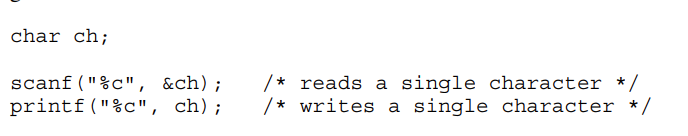

- If the next unread character is a space, then `ch` will contain a space after `scanf` return
- To force skip a white space, put a space between quotes and `%c`

```C
scanf(" %c", &ch); /* skips white space, then reads ch */
```

### Reading and Writing Characters using `getchar` and `putchar`

- `getchar` and `putchar` are alternativas to ``scanf`` and `printf`
- Each time getchar is called, it reads one character then returns an `int` value

```C
ch = getchar(); // reads a character and stores it in ch 
```

- `putchar()` is similar to `printf`, it writes a single characters to the terminal

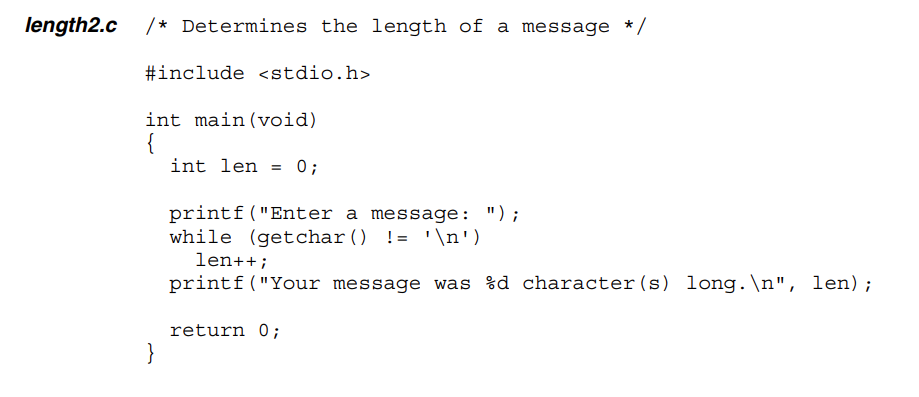

## 7.4 - Type Conversion 

- A computer does not allow arithmetic between 16-bit and 32-bit types
- A computer may do **implicit conversion** to make that possible

### The Usual Arithmetic Conversions

- Arithmetic between `int` and `float` will always result in `float` to not lose fractional parts of the number
- The compiler will always do **promotion** to the narrowest type
    - Ex: Operation with `float` and `double` will make the `float` promote to a `double`
    - `float -> double -> long double`
    - `int -> unsigned int -> long int -> unsigned long int`
    - 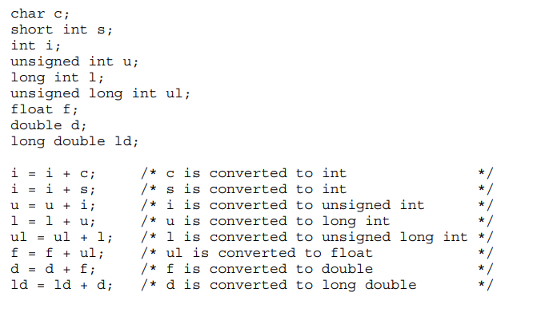

- Conversion don't apply to assignments, the value of the right is converted to the value on the left
    - 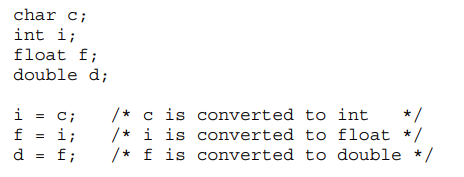

### Implicit Conversions in C99

- C99 gives each integer type an integer conversion rank:
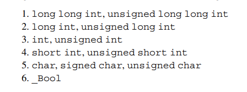


- The type of either operand is a floating type. As long as neither operand has a complex type, the rules are the same as before.
- Neither operand type is a floating type. First perform integer promotion on both operands. If the types of the two operands are now the same, the process ends. Otherwise, use the following rules, stopping at the first one that applies:
    - If both operands have signed types or both have unsigned types, convert the cast expression operand whose type has lesser integer conversion rank to the type of the operand with greater rank.
    - If the unsigned operand has rank greater or equal to the rank of the type of the signed operand, convert the signed operand to the type of the unsigned operand.
    - If the type of the signed operand can represent all of the values of the type of the unsigned operand, convert the unsigned operand to the type of the signed operand.
    - Otherwise, convert both operands to the unsigned type corresponding to the type of the signed operand.

### Casting

- A cast expression has the form:
    - `( type-name ) expression`

- *type-name* specifies the type to which the expression should be converted

```C
i = (int) f; // f is converted to int
```

- *(type-name)* is interpreted as a unary operator, so it has a higher precendence

## 7.5 - Type Definitions

- `typedef int Bool; `
- Using `typedef` causes the compiler to add `Bool` to the list of type names that it recognizes

- There are some premade `typedef` variables that C already implemented ending with `_t`
    - `ptrdiff_t` -> `typedef long int`
    - `size_t` -> `typedef unsigned long int`
    - `wchar_t` -> `typdef int`
- `<stdint.h>` is a C99 header that uses `typedef` for types with a particular number of bits
    - ex: `int32_t`, `uint16_t`

## 7.6 - The `sizeof` Operator

- `sizeof` operator allows a program to determine how much memory is required to store values of a particular type
    - `sizeof ( type-name )`
- The value of the expression `sizeof ( type-name )` is an unsigned integer representing the number of bytes required to store a value belonging to type-name.
- `sizeof (char)` is always 1, but the sizes of the other types may vary.
- On a 32-bit machine, `sizeof ( int )` is normally 4.
- Note that `sizeof` is a rather unusual operator, since the compiler itself can usually determine the value of a `sizeof` expression.

- In C89, is safest to cast into an unsigned long type before printing a `sizeof`
- In C99, no cast is needed but must use the `z` prefer to `%u` to print

```C
printf("Size of int: %lu\n", (unsigned long) sizeof(int)); // C89
printf("Size of int: %zu\n", sizeof(int)); // C99 only
```