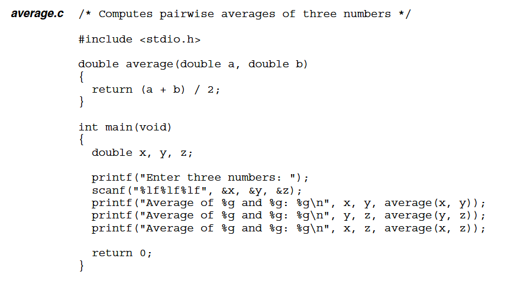
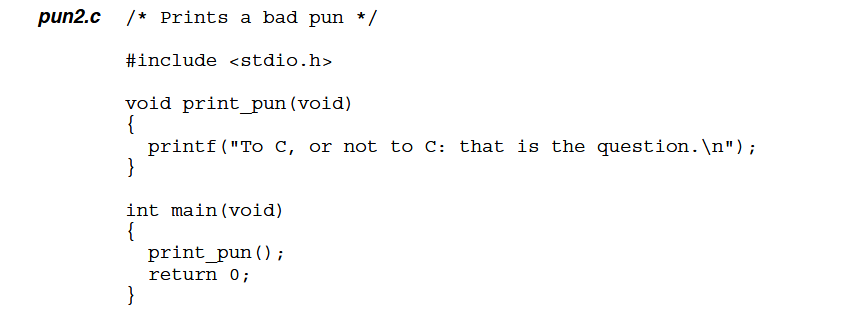
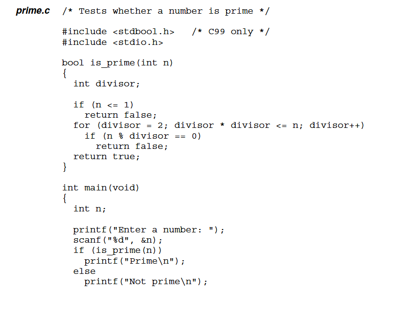
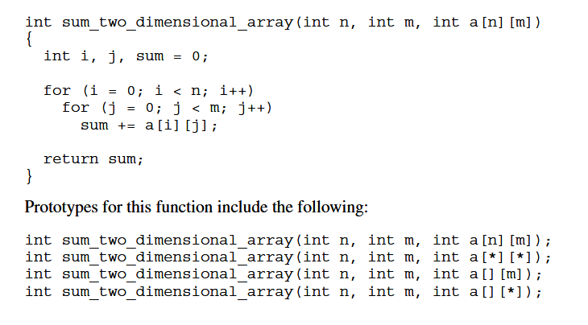
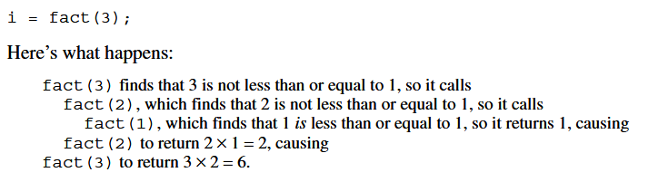
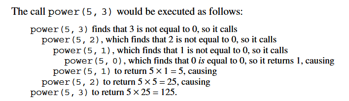

# 9 - Functions

- Building blocks, with its own statements and declarations
- Helps modularize programs to help understanding 

## 9.1 - Defining and Calling Functions

- A function have 3 parts:  
    - The **return type**, everytime its called, it will return only that type, can return nothing with `void` type
    - The **parameters**, the type and varaible that will be used to compute the expression (can be empty)
    - The **body**, with declarations and statements

```C
double average(double a, double b) {
    return (a + b) / 2
}

printf("Average: %g\n", average(x, y));
```

- The `average` function is called with x and y as arguments
- x and y are copied into b
- `printf` prints the value that `average` returns
- the return value is not saved anywhere, unless its on a variable
- the function does not change the values of x and y or a and b



- Example of a `void` function:


- Example of a function with no parameters:



- Variables declared inside a function only exists locally, so they can't be used in other functions



## 9.2 - Function Declarations

- Using a function after the `main` makes the compiler assume that the function will return int
- C provides **function declarations** to better arrange the program and its precedences
    - `return-type function-name ( parameters ) ;`
    - these are know as **function prototypes**
    - the prototype doesnt need the name of the variables it takes as parameters, just the type

## 9.3 - Arguments

- **parameters** represent values to be supplied when the function is called
- arguments are **passed by value**, which represent just a copy of the original variable

### Argument Conversions

- If an `int` argument is passed as argument to a function expecting `double`, that integer will be converted into double 
    - only if the compiler has encoutered the prototype before
- if the compiler has not encoutered the prototype the compiler does the default argument promotions
    - `float` are converted to `double`
    - `char` and `short` are converted to `int`

### Array Arguments

- Arrays can be used as arguments, but the length are unspecified, an additional argument with the length must be provided


- to pass the array to the function, there is no need to use brackets
- if the length passed is smaller than the actual size of the array, the function will ignore the rest and just use the length passed
- in a multidimensional array, the second dimension can't be ommited

#### C99 Variable-Length Array Parameters

- Using a variable-length array parameter, we can explicitly state `a`s length is `n`:
    - `int sum_array(int n, int a[n]) { ... }`
    - It must follow this exact precedence
    
- An asterisk `(*)` can be used so the array will know that the parameter before it should be used as length
    - `int sum_array(int n, int a[*]) { ... }`

- Examples: 
    - 

- Using `static` before the number of the length in the array indicates that that array is guaranteed to be at least the number
    - `int sum_array(int a[static 3], int n) { ... } `
- `static` can be used only in the first dimension

#### Compound Literals

- In C99, you can specify which elements an array contains by a compound literal inside a function call
    - `total = sum_array((int []){3, 0, 3, 4, 1}, 5);`
- the length can be specified or not, if specified and the values are shorter than the length, the rest will be 0
- They can contain arbitrary expressions
    - `total = sum_array((int []){2 * i, i + j, j * k}, 3); `

## 9.4 - The `return` statement

- A non-void function must have a `return` statement
- If the return type doesnt match the declared type, it will be converted to the same as the declared type
- Using only `return`, returns a `void` type and cant be used in functions with types

## 9.5 - Program Termination

- since `main` is a function it must have a return type, usually `int`
- the value returned by `main` is a status code
    - **0** indicates success
    - other values indicate some abnormal termination

### The `exit` Function

- Is an alternative to `return` statements, belonging in the `<stdlib.h>` library

```C
exit(EXIT_SUCCESS); // normal termination
exit(EXIT_FAILURE); // abnormal termination
```

## 9.6 - Recursion

- A function is *recursive* if it calls itself


- It works as:



- Another example:




### The Quicksort Algorithm
 
- This algorithm uses the *divide and conquer*, dividing a larger problem in small pieces many times by the same algorithm
- It goes this way:
    - 

- Here is how a recursive quicksort would work:


- Improving Quicksort:
    1. Improving the partitioning algorithm
    2. Using a different method to sort small arrays (<= 25 elements)
    3. Making Quicksort nonrecursive