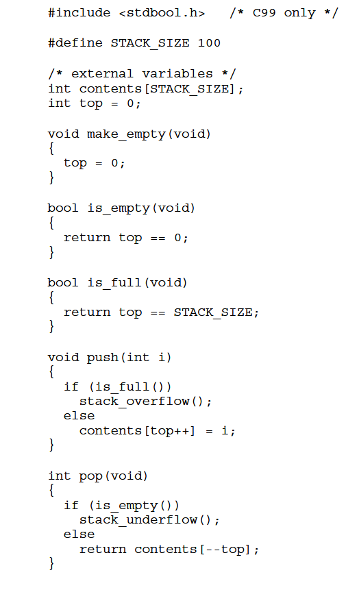
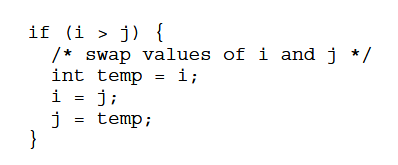
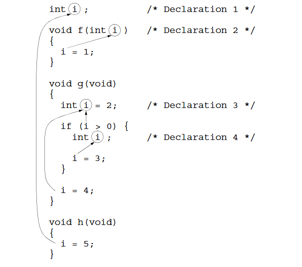

# 10 - Program Organization

## 10.1 - Local Variables

- Local variables have the following properties:
    - **Automatic storage duration**: A variable inside a function is automatically allocated and deallocated when the function ends, the value isn't retained when the function starts again 
    - **Block scope**: Since a variable is only inside a scope, other places can use the same name for other purposes

```C
void f(void)
{
    int i; // scope of i start
} // and ends here
```

### Static Local Variables

- `static` in a declaration of a variables causes it's value to not be automatic, so it retains through the execution 
- A static local variable still has block scope
- Parameters have the same properties

## 10.2 - External Variables

- *External* or *global* variables have the properties:
    - **Static storage duration**: A value stored will stay there indefinitely
    - **File scope**: Visible all the way through a file
- Example of a stack data structure: 
    - 

## 10.3 - Blocks

- A block is a compound statement, normally inside braces



- The storage for the variable is allocated when the block is entered and deallocated when ended
- Just like local and global variables, can be declared `static` 
- Can't be referenced outside the block

## 10.4 - Scope

- The ability of a programmer and compiler to determine which identifier meaning is relevant at a given point in a program

- 
    - `i` is used 5 times with different purposes

## 10.5 - Organizing a C Program

- Order that programs may follow standardly:
    1. `#include` directives
    2. `#define` directives
    3. Type definitions
    4. Declarations of external variables
    5. Prototypes for functions other than `main`
    6. Definitions of `main`
    7. Definitions of other functions

