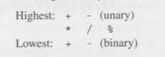
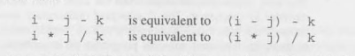
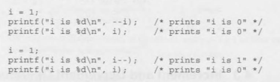

# 4 - Expressions

- Expressions are formulas that show how to compute a value
- The simplest expressions are constants and values
- More complicated expressions contains operators to operands
- C has:
  - Arithmetic operators, `+`, `-`, `*`, `/`
  - Relational operators, `<` `>`
  - Logical operators, `&&`, `||`, `!` 
- and about 50 more

## 4.1 Arithmetic Operators

- Arithmetic operators can perform addition, subtraction, multiplication and division


- `Binary` operators require 2 operands
- Standard operations in math, execept for `%`, which is the remainder of the operations
  - ex: `10 % 4` is `1`, `12 % 4` is `0`
- `Unary` operators require 1 operand
  - `i = +1;`, `j = -i;` 

<br>

- Mixing integer and float operators is allowed
    - `float` and `int` when mixed results in a `float` type
        - ex: `9 + 2.5f` is `11.5` and `6.7f / 2` is `3.35`

- When both operands are integers, the `/` truncates the result
    - `1 / 2` is `0`

- The remainder operator `%` only takes integers
- Using 0 as right operand will cause error
- In negative divisions and remainders, the result is always truncated towards 0
- The value of `i % j` will have the same sign as `i`

### Operator Precedence and Associativity

- The operators have the following precedences: 



- The compile will interpret the signs as the example


- Operators in the same line have equal precedence
- An operator is said to be **left associative** if it groups from left to right



- An operator is said to be **right associative** if it groups from right to left
    - `- + i` is equal to `- (+i)`  

- It is best to use parenthesis to express what operations should take first

## 4.2 Assignment Operators

- C's *simple assignment* operator is used to store values in a variable

### Simple Assignment

- *`v = e`* 
- Copies the value of *e* to *v*
    - `i = 5`: *i* is now *5*

- If *v* is not the same type as *e*, the type of *e* is converted to match the assignment


- Can be chained together
    - `i = k = j = 0`
    - Works as `i = (k = (j = 0))`

### Lvalues

- Left operands
- Variables are **lvalues**, expressions such as `10`or `2 * i` aren't
- It's illegal to put expressions in the *lvalues*
    - `12 = i` - wrong
    - `i + j = 0` - wrong

### Compound Assignment

- Easier way to write expressions 
- `+= -= *= /= %=`
- `i += 1` works almost the same as `i = i + 1`, if it doesn't have a side effect
- `i += j += k` means `i += (j += k)`

## 4.3 Increment and Decrement Operators 

- `i++`, `i--`
- C allows to write easier increment and decrement expressions that were `i = i + 1` with `i++`
- Can only be incremented or decremented by 1
    - To increment more than 1, needs to use **compound assignment**
- Can be used as *prefix* like `++i` or `--i`
    - **prefix** means increment `i` immediately 
    - **postfix** means use the old value of `i` for now, but increment later



## 4.4 Expression Evaluation

- The table is great for knowing where to parenthesis in a complicated expression


```C
i = 2;
j = i * i++;
```

- The value of this expression could be either 4 or 6 
    1. The second operand (the original value of `i`) is fetched, then `i` is incremented
    2. The first operand (the new value of `i`) is fetched
    3. New and old values of `i` are multiplied, yielding 6.
- Fetching means to retrieve a value from memory
- A later change to the variable won't affect the fetched value, which is typically stored in a special locaiton (known as *register*) inside the CPU

## 4.5 Expression Statements

- Any expression can be a statement if used alone
- `++i;` alone is a expression that will increment permanently the value of `i`
- If used like `i + j;`, the value is fetched but not used, then discarded
    - This statement has no effect
