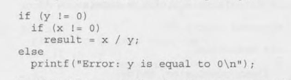
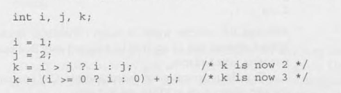
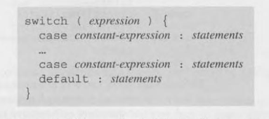
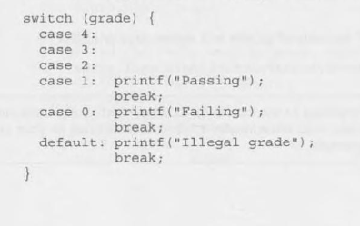
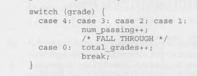

# 5 - Selection Statements 

- C has three types of statements:
    - **Selection statements**. `if` and `switch` give a set of alternatives to a command
    - **Iteration statements**. `while`, `do` and `for` perform loop iterations
    - **Jump statements**. `break`, `continue`, `goto` and `return` cause an unconditional jump

## 5.1 Logical Expressions

- For a some C statements work, they must test a relational expressional to see if its "true" or "false"
- The expression such as `i < j` is either `1 (true)` or `0 (false)`

### Relational Operators

| symbol | meaning
| :--- | :--- 
| < | less than
| > | greater than
| <= | less than or equal to
| >= | greater than or equal to

- these operators can be used to compare *integers*, *floats* and mixed types allowed
- `i + j < k - 1` means `(i + j) < (k - 1)`, 
    - relational operators are lower than arithmetic operators in precedence 

### Equality Operators

| symbol | meaning
| :--- | :---
| == | equal to 
| != | not equal to 

- these operators can be used to compare equality and have lower precedence than relational operators
- `i < j == j < k` means `(i < j) == (j < k)`

### Logical Operators 

| symbol | meaning
| :--- | :---
| ! | logical negation
| && | logical *and*
| \|\| |logical *or*

- `!` operator is unary and `&& and ||` are binary
    -  `!expr` has the value 1 if `expr` has the value 0
    - `expr1 && expr2` has the value 1 if neither values are 0
    - `expr1 || expr2` has the value 1 if one or both values are 1
- if the first expression is already false, then the operators don't evaluate the next expression, this is called `short-circuit`

## 5.2 The `if` statement

- Allows a prorgam to choose between two alternatives
    - `if ( expression ) statement`
- If the expression is not 0, then the statement is executed

### Compound Statements

- To make more than one statement, use the compound statement with:
    - ` { statements }`

- Examples: 

```C
{ line_num = 0; page_num++; }
```
```C
{
    line_num = 0;
    page_num++;
}
```

### The `else` Clause

- An `if` statement may have an `else` clause:
    - ` if ( expression ) statement else statement `

```C
if (i > j)
    max = i;
else
    max = j;
```

- `if` statements can be nested to any depth

### Cascaded `if` Statements

- The most distinct cascaded `if` appearence is:


### The "Dangling `else`" Problem

- C follows the rule that every else follows the nearest `if` statement



- In this case, the `else` belongs to the inner `if`
- Its best to use braces in this cases

### Conditional Expressions

- C also have an operator that allows an expression to produce one of two values of a condition
    - Consists of two symbols: `?` and `:`
    - `expr1 ? expr2 : expr3`
- also referred as **ternary** operators



- Its best to avoid ternary expressions because they cause a lot of confusion

### Boolean Values in C89

- C doesn't have a proper boolean value, so the common use is using int flags with either 0 or 1 
    - `int flag = 0;`
- C89 programmers often use macros with names 
    - `#define TRUE 1`
    - `#define FALSE 0`
    - `flag = TRUE`
- or a macro to a type
    - `#define BOOL int`
    - `BOOL flag;`

### Boolean Values in C99

- C99 provides the `_Bool` type 
    - `_Bool flag;`
- This is a unsigned integer that can only be assigned to 0 or 1
- Any value that is not 0 will be assigned 1 to it
    - `flag = 5;     /* flag is assigned 1 */`
- The `<stdbool.h>` header makes it easier to work with Boolean values
    - it supplies macros named `true` and `false`

## 5.3 The `switch` statement

- Is an alternative to a cascade `if` statement, when you have lots of conditions to evaluate 


- The value is tested against 4, 3, 2, 1 and 0. If it matches 4 the message *Excellent* is printed
- When it sees the `break` statement goes to another block
- If none of the `case` matches, then the `default` block is evaluated 



- **Controlling expression**: The word `switch` must be followed by an integer expression in parenthesis
- **Case labels**: constant-expression can't contain variables or function calls
- **Statements**: No braces are required, the last statement usually is `break`
- Duplicate case labels aren't allowed
- The order of the cases don't matter
- The `default` case doesn't need to come last
- Several case labels may precede the same group of statements



### The Role of the `break` statement

- The `break` statement causes the program to "break" out of the `switch` statement
- Execution continues at the next `switch` statement
- If there is no `break` statement, the next cases are still going to be checked




