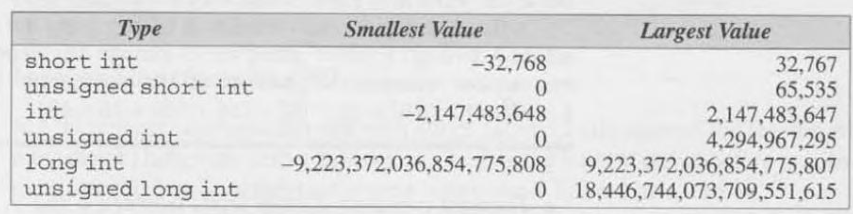
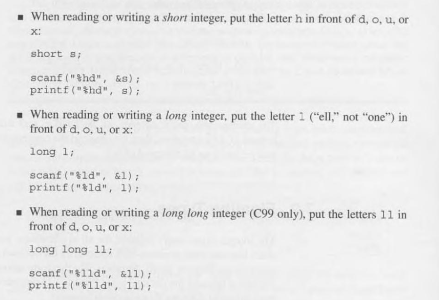

# 7 - Basic Types

- Full range of integer types:
    - `long integers`
    - `short integers`
    - `unsigned integers`

- Full range of float types:
    - `double`
    - `long double`

- `char` type
- `typedef` define new type names
- `sizeof` operator

## 7.1 - Integer Types

- Integer types are divided into two categories:
    - signed and unsigned

### Signed and Unsigned Integers 

- The leftmost bit of a **signed** integer is the sign bit, 0 if its positive or 1 if its negative
- The leftmost bit of a **unsigned** integer is part of the number's magnitude
- The largest 16-bit integer is:
    - `0111111111111111` which is *32,767*
- The largest 32-bit integer is:
    - `01111111111111111111111111111111` which is *2,147,483,647*
---

- `int` type is usually 32 bits 
- We can specify that a variably is `long`, `short`, `signed` or `unsigned`: 
 

- Using `signed` is redundant
- Omitting `int` to abbreviate the names of integer types is allowed

- Integer Types on a 16-bit Machine: 
- Integer Types on a 32-bit Machine: 
- Integer Types on a 64-bit Machine: 

- This may vary between compilers
- `<limits.h>` header works to check this

### Integer Types in C99

- C99 provides two additional standard integer types:
    - `long long int`
        - has a range of **-2^63** (`-9,223,372,036,854,775,808`) to **-2^63**
    - `unsigned long long int`
        - has a range of **0** to **2^64 - 1** (`18.446.744,073,709,551,615`)

### Integer Constants

- C allows integer constants to be written in decimal (base 10), octal (base 8), or hexadecimal (base 16).

- Decimal constants: Contain only digits 0 through 9 
    - Must not begin with a `0`
    - Ex. `32767`

- Octal constants: Written using only 0 through 7, where each position in an octal number represents a power of 8.
    - Must begin with a `0`
    - Ex. `077777`

- Hexadecimal constants: Contain only digits 0 though 9 and letter between a and f
    - Must begin with `0x`
    - May be either upper or lower case
    - Ex. `0x7fff`

- Postfixing `L` or `l` make the compiler read the constant as a `long int`
- Postfixing `U` or `u` make the compiler read the constant as a `unsigned`

### Integer Constants in C99

- in C99, postfixing `LL` or `ll` have type `long long int`

### Integer Overflow

- When you make an operation like `int + int` and the result is bigger than an `int` type, thats called **overflow**
- The result is undefined behaviour

### Reading and Writing Integers

- If used `u`, `o`, or `x` in the conversion specification:
    - `u` means decimal notation
    - `o` means octal notation
    - `x` means hexadecimal notation

## 7.2 - Floating Types

- Full range of floating types:
    - `float` Single-precision floating-point
    - `double`  Double-precision floating-point
    - `long double`  Extended-precision floating-point

- Characteristics of floating types according to the IEEE standard: 

- `<float.h>` provides macros that define characteristics of floating types
- C99 has two categories:
    - **real floating types**
         - `float`
         - `double`
         - `long double`
    - **complex types**
        - `float_Complex`
        - `double_Complex`
        - `long double_Complex`

### Floating Constants

- A floating constant must contain a decimal point and/or an exponent
- To force the compiler to store a constant in a floating point you postfix the letter `F` or `f` 
- To do that in a long double format you postfix `L` or `l`

### Reading and Writing Floating-Point Numbers

- `%e`, `%f` and `%g` are used for single-precision floating numbers
- double and long double require:
    - `%lf` when reading and writing a double
        - in `printf`, you may use the single-precision ones
    - `%lf`, `%le` or `%lg` when reading and writing a long double
         
## 7.3 Character Types